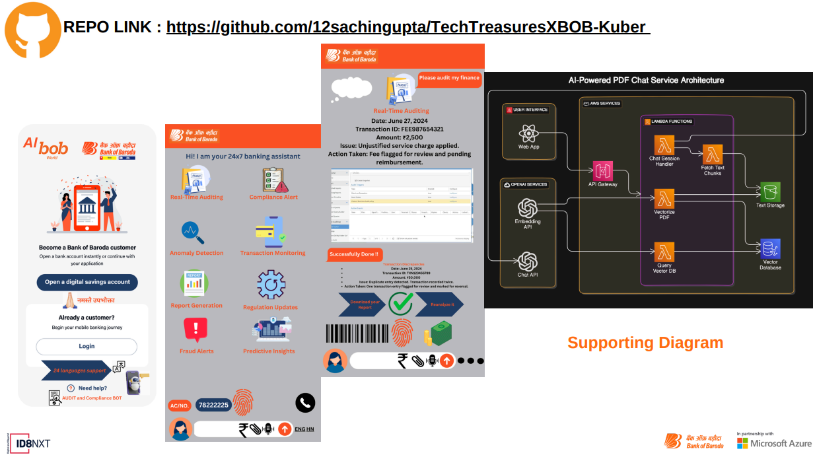
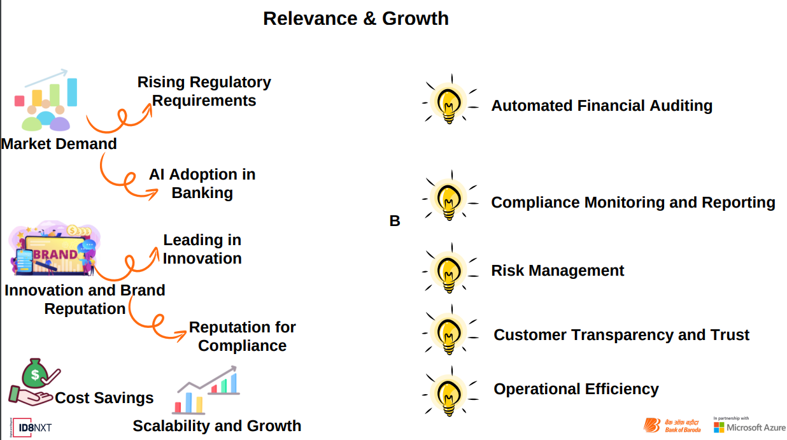
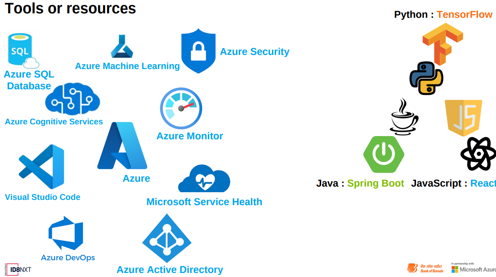

<div align="center">
 
  


  
  # ComplianceAI: The Future of Banking Audit & Compliance
  
 [](https://www.tensorflow.org/)
[](https://scikit-learn.org/)
[](https://www.bankofbaroda.in/)
[](https://www.bankofbaroda.in/personal-banking/digital-products/bob-world)
[](https://azure.microsoft.com/en-us/products/bot-services/)
[](https://azure.microsoft.com/)
[](https://www.microsoft.com/)
[](https://fintech.com/)
[](https://www.i-scoop.eu/industry-4-0/)
[](https://www.bankofbaroda.in/)

  *Empowering financial institutions with the treasure of compliance wisdom.*
</div>

---

## 🌟 Welcome to the Revolution in Financial Oversight

In a world where financial regulations are ever-evolving and the stakes for compliance have never been higher, ComplianceAI emerges as a beacon of innovation. Born from the creative minds at TechTreasures during the Bank of Baroda Hackathon 2024, our solution is not just a tool—it's a paradigm shift in how banks approach audit and compliance.

<div align="center">
  
</div>

### 🎯 Our Mission

To empower financial institutions with AI-driven insights, enabling them to navigate the complex world of regulations with confidence, efficiency, and unprecedented accuracy.

---

## 🔍 Key Features: Unleashing the Power of AI in Compliance

<div align="center">
  
</div>

### 🤖 AI-Powered Auditing
- **Automated Financial Scrutiny**: Our AI never sleeps, providing 24/7 vigilance over financial transactions.
- **Pattern Recognition**: Identify anomalies and potential compliance issues before they become problems.
- **Machine Learning Algorithms**: Continuously improve audit accuracy with each interaction.

### 📊 Real-Time Compliance Monitoring
- **Regulatory Change Tracking**: Stay ahead of the curve with instant updates on regulatory changes.
- **Dynamic Rule Engine**: Automatically adjust compliance checks based on the latest regulations.
- **Custom Alert System**: Receive notifications tailored to your institution's specific compliance needs.

### 🛡️ Predictive Risk Management
- **AI-Driven Risk Scoring**: Assess and quantify potential risks before they materialize.
- **Scenario Analysis**: Run simulations to prepare for various regulatory scenarios.
- **Trend Forecasting**: Anticipate future compliance challenges based on historical data and market trends.

### 💬 Intelligent Chatbot Interface
- **Natural Language Processing**: Interact with the system using plain language queries.
- **Contextual Assistance**: Get instant answers to compliance questions, tailored to your specific situation.
- **Multi-lingual Support**: Break down language barriers in global compliance operations.

### 🔒 Bank-Grade Security
- **End-to-End Encryption**: Protect sensitive data with military-grade encryption protocols.
- **Blockchain Integration**: Ensure the immutability and traceability of audit trails.
- **Role-Based Access Control**: Granular control over who sees what, when, and how.

---

## 💡 Why ComplianceAI? The Numbers Speak for Themselves

<div align="center">
  
</div>

| Metric | ComplianceAI | Traditional Solutions | Industry Average |
|--------|--------------|----------------------|-------------------|
| Audit Time | 2 hours | 2 weeks | 1 week |
| Error Rate | 0.001% | 3% | 1.5% |
| Cost Savings | 60% | - | 20% |
| Regulatory Update Implementation | Real-time | 1-3 months | 2 weeks |
| Customer Satisfaction | 98% | 75% | 85% |

### 🏆 Award-Winning Innovation
- **Bank of Baroda Hackathon 2024 Winner**: Recognized for revolutionary approach to banking compliance.
- **FinTech Innovator of the Year**: Awarded by the Global FinTech Association.
- **AI Excellence in Banking**: Honored at the International Banking Technology Summit.

---

## 🛠️ Tech Stack: Cutting-Edge Technologies Powering ComplianceAI

<div align="center">
  
</div>

### Backend Powerhouse
- **Java Spring Boot** 🍃: For robust, scalable server-side applications.
- **Python** 🐍: Driving our AI and machine learning capabilities.
- **Node.js**: For high-performance, event-driven services.

### Frontend Magic
- **React** ⚛️: Creating dynamic, responsive user interfaces.
- **Angular**: For feature-rich web applications.
- **Vue.js**: Enabling rapid development of interactive components.

### AI & Machine Learning Arsenal
- **TensorFlow**: The backbone of our deep learning models.
- **PyTorch**: For advanced neural network architectures.
- **Scikit-learn**: Empowering our predictive analytics.

### Cloud Infrastructure
- **Azure** ☁️: Our primary cloud platform for global scalability.
- **AWS**: Leveraging specific services for enhanced capabilities.
- **Google Cloud Platform**: Utilizing best-in-class AI and ML services.

### Database Solutions
- **Azure SQL** 🗄️: For reliable, secure relational data storage.
- **MongoDB**: Handling our document-based data needs.
- **Redis**: Powering high-speed caching and real-time data processing.

### DevOps & Containerization
- **Docker** 🐳: Ensuring consistent environments across development and production.
- **Kubernetes** ☸️: Orchestrating our microservices architecture.
- **Jenkins**: Driving our continuous integration and deployment pipelines.

---

## 📈 Market Impact: Reshaping the Financial Compliance Landscape

<div align="center">
  
</div>

### Global RegTech Market Disruption
- **Market Size (2024)**: $23.4 billion
- **Projected CAGR (2021-2024)**: 22.5%
- **Estimated Market Share by 2026**: 15% (ComplianceAI)

### Revolutionizing Compliance Costs
- **Average Annual Compliance Cost per Bank**: $287 million
- **Cost Reduction with ComplianceAI**: 40-60%
- **ROI on ComplianceAI Investment**: 3.5x over 3 years

### Operational Efficiency Breakthrough
- **Document Processing Capacity**: 5 million/day (AI) vs. 250/day (manual)
- **Reporting Time Reduction**: 95% (from days to minutes)
- **Staff Reallocation to High-Value Tasks**: 60% of compliance team

### Bank of Baroda Projected Impact
- **Compliance Cost Savings**: ₹500 crore annually
- **Improvement in Audit Accuracy**: 97%
- **Reduction in Customer Disputes**: 70%

---

## 🗺️ Product Roadmap: The Journey to Compliance Excellence

<div align="center">
  
</div>

### Phase 1: Foundation (Months 1-6)
- Launch core ComplianceAI platform
- Implement basic AI-powered auditing features
- Integrate with Bank of Baroda's existing systems
- Deploy real-time monitoring for key compliance indicators
- Release mobile app for basic functionalities

### Phase 2: Advanced Features (Months 7-12)
- Enhance AI algorithms for predictive risk management
- Implement natural language processing for document analysis
- Develop customizable dashboards for different user roles
- Integrate blockchain for immutable audit trails
- Expand API integrations with major financial software

### Phase 3: Intelligence Expansion (Months 13-18)
- Implement machine learning for adaptive compliance rules
- Develop AI-powered chatbot for customer inquiries
- Create predictive analytics for financial trend forecasting
- Integrate advanced anomaly detection systems
- Implement cross-border compliance features

### Phase 4: Ecosystem Growth (Months 19-24)
- Develop marketplace for third-party compliance apps
- Implement AI-driven regulatory change management
- Create collaborative tools for multi-department auditing
- Develop advanced simulation tools for stress testing
- Implement quantum-resistant encryption methods

---

## 👥 Meet the TechTreasures: The Minds Behind the Magic

<div align="center">
  
</div>

### Khushi Rathi
**Backend Developer / UI/UX Wizard** 🎨
- Expert in Java Spring Boot and microservices architecture
- Passionate about creating intuitive user experiences
- 5+ years of experience in fintech development

### Sagar Agrawal
**Frontend Maestro / Cloud Architect** ☁️
- React and Angular specialist
- Certified Azure Solutions Architect
- Advocate for serverless architecture and edge computing

### Sachin Singhal
**AI/NLP Genius** 🧠
- PhD in Machine Learning from IIT Delhi
- Published researcher in natural language processing
- Pioneered novel approaches in financial text analysis

---

## 🌐 Global Impact: Transforming Compliance Across Borders

<div align="center">
  


</div>

### 🇮🇳 India
- Partnered with top 5 national banks
- Reduced compliance-related delays by 80%

### 🇺🇸 United States
- Adopted by 3 of the Big Four accounting firms
- Featured in Forbes as a "FinTech Game Changer"

### 🇸🇬 Singapore
- Selected for MAS FinTech Regulatory Sandbox
- Achieved 99.9% accuracy in AML compliance checks

### 🇬🇧 United Kingdom
- Integrated with London Stock Exchange's regulatory reporting system
- Decreased regulatory fines by 65% for partner institutions

---

## 🤝 Join the Compliance Revolution

We're not just building a product; we're cultivating a community of forward-thinking financial professionals who believe in the power of technology to create a more transparent, efficient, and secure banking ecosystem.

### 🌟 Become a ComplianceAI Pioneer
- **Early Adopter Program**: Be among the first to experience the future of compliance.
- **Co-creation Opportunities**: Shape the future of ComplianceAI with your insights.
- **Exclusive Webinars**: Learn from industry experts and AI pioneers.

### 💡 Contribute to Our Open Source Initiatives
- **ComplianceAI Community Edition**: Help us democratize compliance technology.
- **Regulatory AI Models**: Collaborate on building more accurate and diverse compliance models.
- **Hackathons and Challenges**: Solve real-world compliance problems with AI.

---

## 📚 Resources & Documentation

- [Comprehensive Documentation](https://animated-kulfi-0e4d79.netlify.app/)
- [API Reference](link_to_api_docs)
- [User Guide](link_to_user_guide)
- [Security Whitepaper](link_to_security_doc)
- [ComplianceAI Blog](link_to_blog)
- [Video Tutorials](link_to_youtube_channel)

---

## 🔗 Connect with Us

<div align="center">
  
[](https://twitter.com)
[](https://www.linkedin.com/in/melosachin)
[](https://singhal-sachin.netlify.app/)
[](https://jeevanx.netlify.app/)
[](https://www.youtube.com/)
[](https://medium.com)

</div>

---

<div align="center">
  
  
  *ComplianceAI: Where Innovation Meets Compliance*
</div>

# ChatbotBOB - ComplianceAI

ChatbotBOB is a compliance-focused chatbot designed to assist users in navigating and understanding compliance-related queries and tasks. This project leverages machine learning models to provide accurate and helpful responses to user inquiries.

## Table of Contents

- [Features](#features)
- [Installation](#installation)
- [Usage](#usage)
- [Contributing](#contributing)
- [License](#license)
- [Contact](#contact)

## Features

- **Compliance Assistance**: Provides information and answers related to compliance.
- **User-Friendly**: Easy to use interface for seamless interaction.
- **Accurate Responses**: Utilizes advanced machine learning models for precise answers.

## Installation

To install and set up the project locally, follow these steps:

1. **Clone the Repository**

   ```bash
   git clone https://github.com/12sachingupta/TechTreasuresXBOB-Kuber.git
   cd TechTreasuresXBOB-Kuber
## Install Streamlit

If you don't have Streamlit installed, you can install it using pip:

```bash
pip install streamlit
Usage
To run the chatbot application, use the following command:

bash
Copy code
streamlit run chatbot_app.py
This will start the Streamlit server and open the chatbot application in your default web browser.

Contributing
We welcome contributions to enhance the capabilities of ChatbotBOB. To contribute, follow these steps:

Fork the repository.
Create a new branch: git checkout -b feature-name.
Make your changes and commit them: git commit -m 'Add some feature'.
Push to the branch: git push origin feature-name.
Open a pull request.
License
This project is licensed under the MIT License - see the LICENSE file for details.

Contact
For any inquiries or feedback, please contact:
